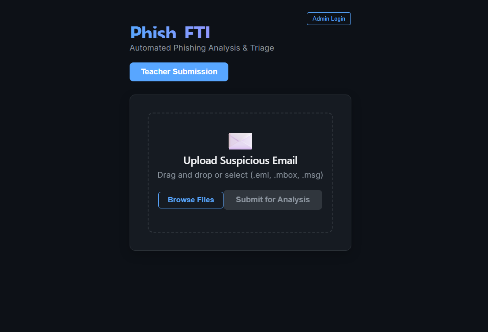
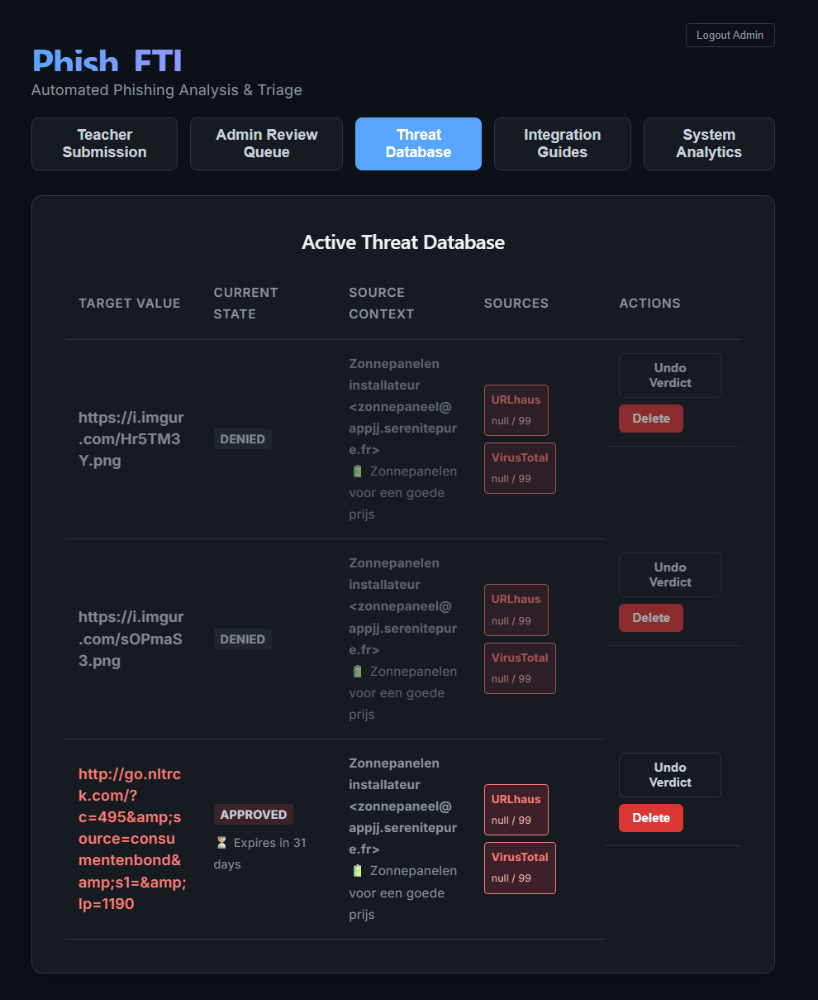
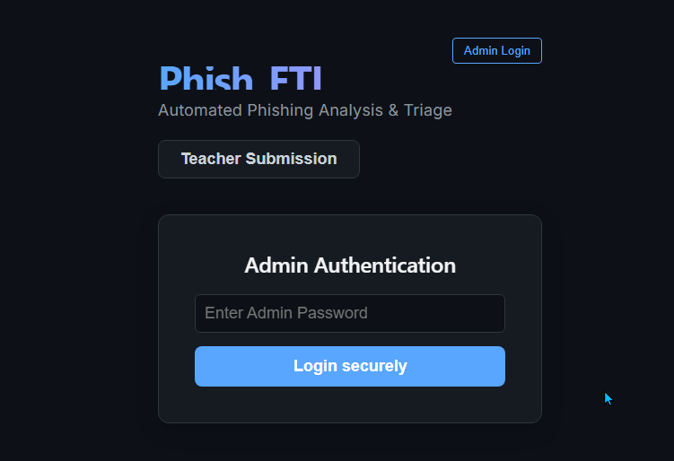
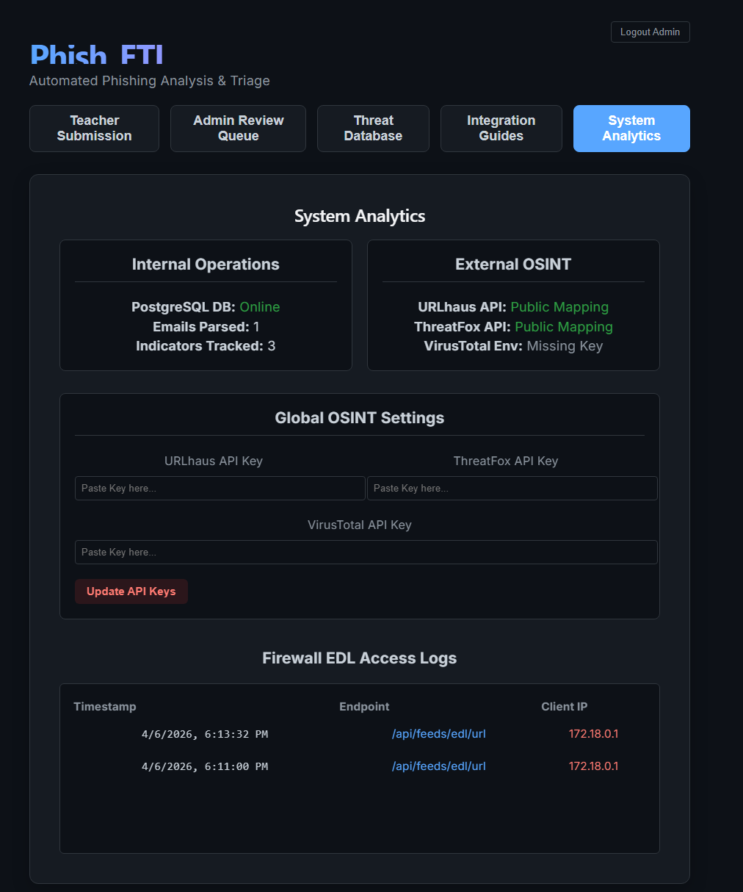

# Phish_ETL
Automated Phishing Analysis, Triage & Firewall Enforcement

Phish_ETL is a fully automated phishing ingestion, enrichment, and enforcement platform designed to turn suspicious emails into **live, auto-expiring firewall blocklists** with minimal analyst effort.

Upload suspicious emails → extract indicators → enrich with OSINT → approve → publish directly to NGFW External Dynamic Lists (EDLs).

---

## Why Phish_ETL Exists

Security teams routinely face:

- Manual IOC extraction from phishing emails
- Multiple OSINT tools with no lifecycle control
- Firewall blocklists that grow forever
- No automatic cleanup of stale indicators

Phish_ETL solves this by providing **opinionated, lifecycle-aware phishing automation** that feeds directly into your firewalls.

---

## Platform Architecture

- **Backend:** FastAPI (Python / ASGI)
- **Database:** PostgreSQL
- **Frontend:** React
- **Deployment:** Docker Compose (single stack)

Everything runs locally or on-prem with no external dependencies beyond optional OSINT APIs.

---

## End‑User Workflow

### 1. Submit a Suspicious Email

End users (teachers, staff, intake queues) upload suspicious emails via the public portal.

Supported formats:
- `.eml`
- `.msg`
- `.mbox`

Duplicates are automatically rejected using strict `Message-ID` hashing.

---

### 2. Automated IOC Extraction & Enrichment

Once ingested, Phish_ETL automatically:

- Extracts URLs and IPs from deeply nested MIME payloads
- Normalizes and deduplicates indicators
- Enriches indicators asynchronously using:
  - URLhaus
  - ThreatFox
  - VirusTotal (optional)

Each indicator receives a **0–99 confidence score** based on OSINT consensus.

---

### 3. Analyst Review & Governance (Admin)

Admins authenticate to:

- Review indicators
- Approve or deny enforcement
- Undo previous verdicts
- Permanently delete indicators from disk

This ensures **human governance** over automated enforcement.

---

### 4. Firewall Integration (Zero Maintenance)

Approved indicators are immediately published to External Dynamic Lists:

- URL Feed  
  `/api/feeds/edl/url`

- IP Feed  
  `/api/feeds/edl/ip`

Key properties:
- Zero duplicate rows (schema-enforced)
- Read-only consumption by firewalls
- No agents, no cron jobs, no manual exports

---

### 5. Automatic Indicator Expiration (TTL)

To prevent firewall memory leakage:

- All indicators expire **30 days** after ingestion
- TTL is enforced automatically
- Expired indicators disappear from feeds without admin action

This keeps firewall rule memory clean and predictable.

---

## Security Model

- Single-admin JWT-based authentication
- Admin actions fully protected
- No exposed OSINT API keys
- Public submission interface is non-privileged

---

## System Analytics

Admins can review:

- Database health
- Emails ingested
- Indicators tracked
- OSINT engine availability
- Firewall EDL access logs

